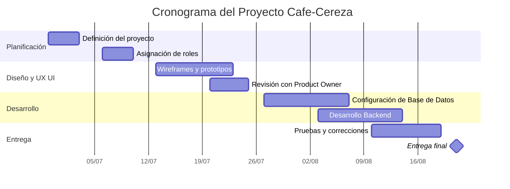

# Proyecto Integrador

## Cafe Cereza

 

**Café Cereza** es una cafetería consolidada dentro de su comunidad que busca fortalecer su presencia digital y acercarse a sus clientes de una manera más moderna, accesible y directa.

Este proyecto integrador propone el desarrollo de una solución digital que combina una **página web para clientes** con la **recopilación, organización y análisis de datos del negocio**.

La plataforma permite que los usuarios puedan consultar el menú de alimentos y bebidas, conocer promociones y productos de temporada, revisar horarios de atención, localizar el establecimiento, consultar medios de contacto y acceder a funciones relacionadas con pedidos y reservaciones.

Además, la información generada permite construir una base para analizar el comportamiento del negocio y apoyar posteriormente la toma de decisiones.

---

</div>
<h3 align="center">Organigrama del Proyecto Cafe-Cereza</h3>

<table align="center">
  <thead>
    <tr>
      <th align="center">Foto</th>
      <th align="left">Integrante</th>
      <th align="left">Rol Scrum</th>
      <th align="center">Matrícula</th>
    </tr>
  </thead>
  <tbody>
    <tr>
      <td align="center">
        
      </td>
      <td>Michelle de la Cruz Rosalino</td>
      <td>Scrum Master</td>
      <td align="center">230091</td>
    </tr>
    <tr>
      <td align="center">
        
      </td>
      <td>Yuleni Gayosso Martínez</td>
      <td>Desarrollador Backend, UX/UI</td>
      <td align="center">230145</td>
    </tr>
    <tr>
      <td align="center">
        
      </td>
      <td>José de Jesús Hernández Casiano</td>
      <td>Product Owner</td>
      <td align="center">230535</td>
    </tr>
  </tbody>
</table>

---

## Objetivo del proyecto

Desarrollar una solución digital para Café Cereza que facilite la interacción entre la cafetería y sus clientes mediante una página web moderna y responsiva, mientras se aprovechan los datos relacionados con ventas, productos, clientes, pedidos y reservaciones para generar información útil para el negocio.

El proyecto busca integrar dos perspectivas:

**Experiencia del cliente:** facilitar el acceso al menú, promociones, información, pedidos y reservaciones.

**Analítica del negocio:** organizar y analizar los datos para identificar patrones, tendencias e indicadores que puedan apoyar la toma de decisiones.

---

## Problemática

Los clientes de una cafetería, especialmente aquellos con tiempos limitados, necesitan consultar rápidamente productos, precios, promociones, horarios y disponibilidad de servicios.

Al mismo tiempo, cuando la información relacionada con pedidos, productos, clientes y reservaciones no se encuentra organizada, resulta más difícil utilizarla para conocer el comportamiento del negocio.

---

## Solución propuesta

La solución integra diferentes componentes que trabajan en conjunto:

### Página web

Espacio digital diseñado para facilitar la interacción con los clientes y centralizar información relevante de Café Cereza.

Entre sus funciones se contemplan:

- Consulta del menú.
- Promociones vigentes.
- Productos de temporada.
- Horarios de atención.
- Ubicación del establecimiento.
- Información de contacto.
- Reservaciones.
- Pedidos anticipados.
- Aviso de privacidad.
- Términos y condiciones.
- Diseño adaptable a dispositivos móviles y computadoras.

### Arquitectura de datos

Se diseñó una estructura para organizar información relacionada con elementos como:

- Clientes.
- Productos.
- Pedidos.
- Detalles de pedidos.
- Pagos.
- Reservaciones.
- Mesas.

Esta organización permite mantener relaciones coherentes entre la información utilizada dentro del proyecto.

### Preparación y calidad de datos

Antes de realizar los análisis, los datos pasan por procesos de revisión, limpieza, transformación y validación.

Esto permite trabajar aspectos como valores nulos, duplicados, formatos, consistencia e integridad de los registros.


### Analítica de datos

A partir de los datos preparados se realizan análisis que permiten estudiar:

- Comportamiento de las ventas.
- Productos y categorías.
- Horarios de mayor actividad.
- Canales de venta.
- Comportamiento temporal.
- Tendencias y estacionalidad.
- Segmentación de clientes.
- Asociaciones entre productos.
- Estimaciones de demanda.

> **Nota:** los datos utilizados para desarrollar y validar la parte analítica del proyecto son simulados bajo reglas de negocio, por lo que los resultados representan el comportamiento del dataset construido y no ventas históricas reales de Café Cereza.

### Indicadores de desempeño

El proyecto también contempla KPI que permiten resumir información relevante para el negocio, como:

- Ticket promedio.
- Cantidad de pedidos.
- Productos más vendidos.
- Tasa de cancelación.
- Tiempo de entrega.
- Otros indicadores relacionados con el desempeño de Café Cereza.

---

## ¿Cómo funciona la propuesta?

El proyecto puede entenderse mediante el siguiente flujo:

```text
Cliente
   ↓
Página web
   ↓
Pedidos y reservaciones
   ↓
Base de datos
   ↓
Preparación y validación
   ↓
Análisis de datos
   ↓
Indicadores
   ↓
Información para la toma de decisiones
```

De esta manera, la propuesta no se limita únicamente al desarrollo de una página web, sino que busca conectar la **experiencia del cliente, la operación y los datos**.

---

## Estructura del repositorio

El repositorio contiene las evidencias y recursos desarrollados durante el proyecto.

| Sección | Contenido |
|---|---|
|  Contexto y objetivos | Problemática, objetivos y preguntas de negocio |
|  Arquitectura de datos | Entidades, atributos, relaciones y diccionario de datos |
| Simulación | Reglas de negocio, generación y datasets |
| Calidad y ETL | Limpieza, transformaciones, validaciones y datasets procesados |
|  Análisis exploratorio | Estadísticas, tablas, gráficas e interpretaciones |
|  Análisis de diagnóstico | Pronóstico, segmentación y otros mecanismos analíticos |
|  KPI | Indicadores, fórmulas, metas y criterios de evaluación |

---

## Diagrama de Gantt



---

##  Tecnologías y herramientas

Durante el desarrollo del proyecto se utilizan diferentes tecnologías y herramientas para cubrir las áreas de desarrollo web, bases de datos y analítica.

- HTML, CSS y tecnologías web.
- SQL.
- Python.
- Pandas.
- NumPy.
- Jupyter Notebook.
- Git.
- GitHub.
- Herramientas de visualización y análisis de datos.

---

##  Valor de la propuesta

Café Cereza busca integrar tecnología y analítica dentro de una misma solución.

### Para los clientes

✔ Acceso rápido a información.  
✔ Consulta del menú y promociones.  
✔ Reservaciones y pedidos anticipados.  
✔ Experiencia digital accesible desde diferentes dispositivos.

### Para Café Cereza

✔ Mayor presencia digital.  
✔ Información organizada.  
✔ Datos preparados para análisis.  
✔ Identificación de patrones y tendencias.  
✔ Seguimiento mediante indicadores.  
✔ Mayor soporte para la toma de decisiones.

---

##  Información académica

**Proyecto Integrador**  
Tecnologías de la Información — Entornos Virtuales y Negocios Digitales  
Universidad Tecnológica de Xicotepec de Juárez

---

##  Dashboard CafeCereza Administrador

<p align="center">
  <b> Café Cereza</b><br>
  <i>Experiencia digital, datos y decisiones.</i>
</p>


